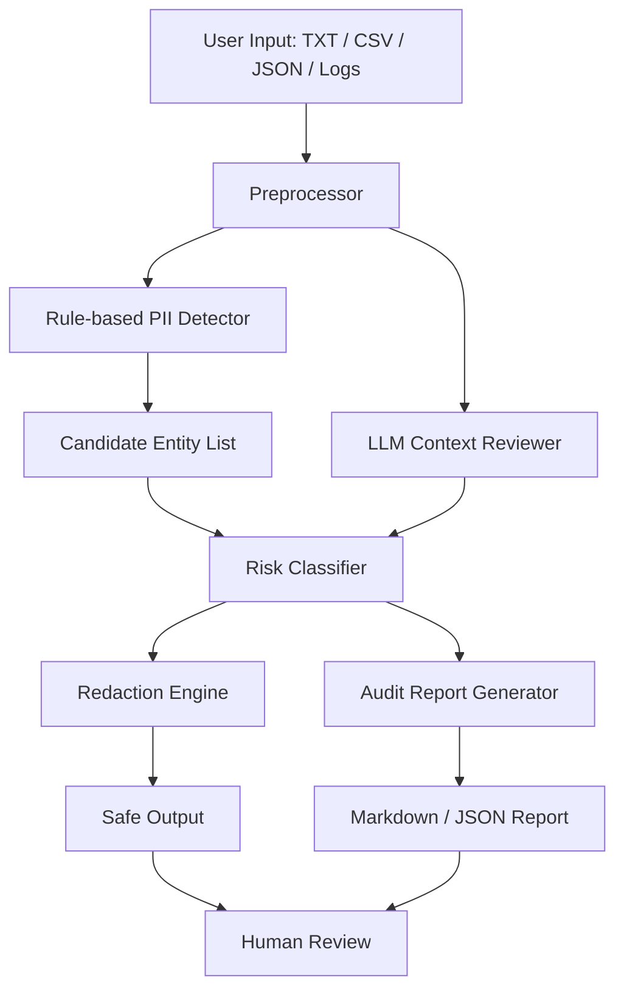
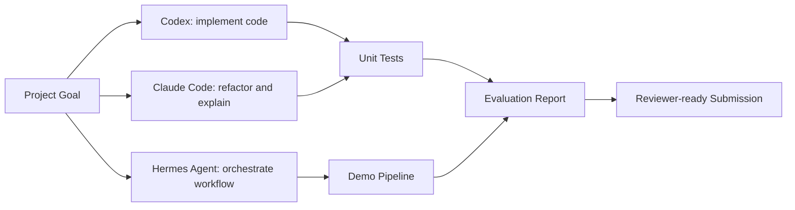

# Architecture

## High-level architecture



## Multi-agent development workflow



## Components

### 1. Preprocessor

Normalizes text, detects file type, splits long inputs into chunks, and preserves line/column offsets for reporting.

### 2. Rule-based detector

Finds common PII such as:

- Email address
- Phone number
- ID-like number
- Credit-card-like sequence
- IP address
- URL
- Address-like pattern

### 3. LLM context reviewer

Checks whether a detected entity is truly sensitive in context. For example, it can distinguish a fake placeholder email from a real personal email.

### 4. Risk classifier

Assigns risk levels:

- High: government ID, financial data, full address, private phone number
- Medium: email, student ID, account ID
- Low: organization name, public website, generic placeholder

### 5. Redaction engine

Replaces sensitive spans with stable tags:

```text
john@example.com -> [EMAIL]
+60 12-345 6789 -> [PHONE]
```

### 6. Report generator

Produces a readable audit report containing:

- Summary
- Risk level
- Findings by category
- Original span location
- Redaction decision
- Recommended next action
